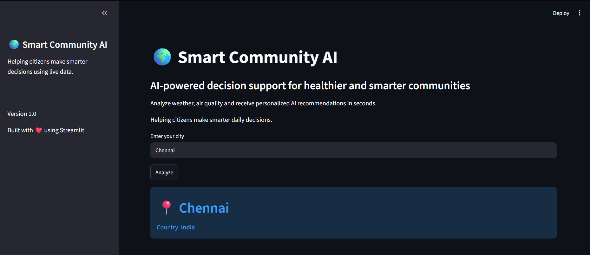
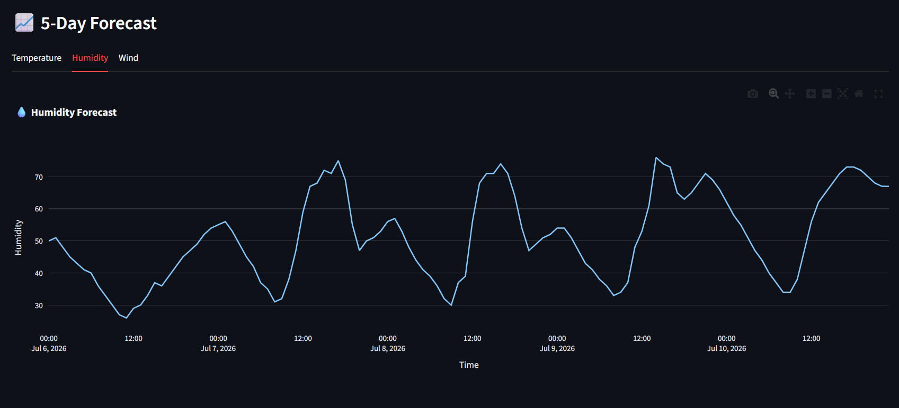
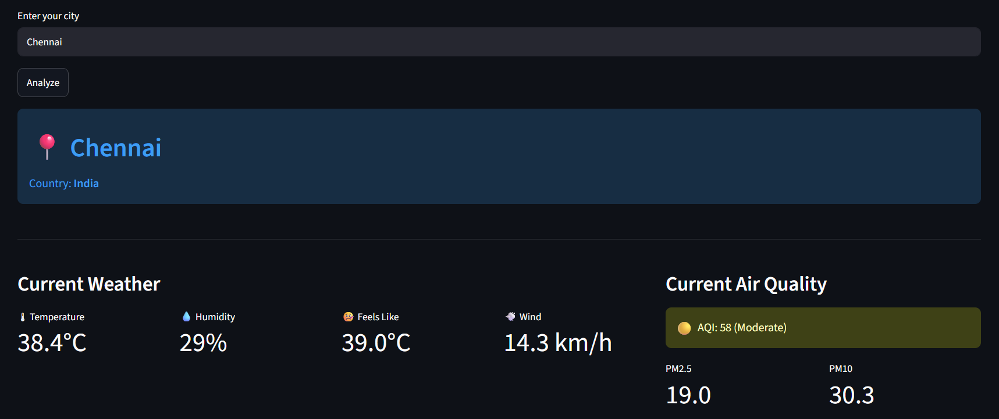

# 🌍 Smart Community AI

> AI-powered decision support system for healthier and smarter communities.


---

## 📖 Overview

Smart Community AI is an intelligent dashboard that combines:

- 🌤 Live Weather
- 🌫 Air Quality Monitoring
- 📈 5-Day Forecast
- 🤖 AI-generated recommendations
- 🏆 Community Wellness Score
- 📍 Interactive Location Map

The goal is to help people make smarter daily decisions using real-time environmental data and AI.

---

## ✨ Features

- 🌡 Live Weather Information
- 🌫 Air Quality (AQI)
- 📊 Interactive Forecast Charts
- 🤖 Gemini AI Recommendations
- 🏆 Community Wellness Gauge
- 📍 Interactive Map
- 📄 Downloadable Report (Coming Soon)

---

## 🛠 Tech Stack

- Python
- Streamlit
- Plotly
- Folium
- Open-Meteo API
- Google Gemini AI

---

## 📂 Project Structure

```text
app.py
utils/
assets/
requirements.txt
```

---

## 🚀 Installation

Clone the repository

```bash
git clone https://github.com/Keerthivarman-S-D/smart-community-ai.git
```

Go inside

```bash
cd smart-community-ai
```

Install packages

```bash
pip install -r requirements.txt
```

Create a `.env` file

```env
GEMINI_API_KEY=YOUR_API_KEY
```

Run

```bash
streamlit run app.py
```

---

## 📸 Dashboard





---

## 🎯 Future Improvements

- 🚨 Disaster Alerts
- 📱 Mobile App
- 🌍 Multi-language Support
- 📊 Historical Data Analytics
- 📈 Smart City Comparison

---

## 👨‍💻 Author

**Keerthivarman S D**

Computer Science Engineering  
Madras Institute of Technology

GitHub:
https://github.com/Keerthivarman-S-D